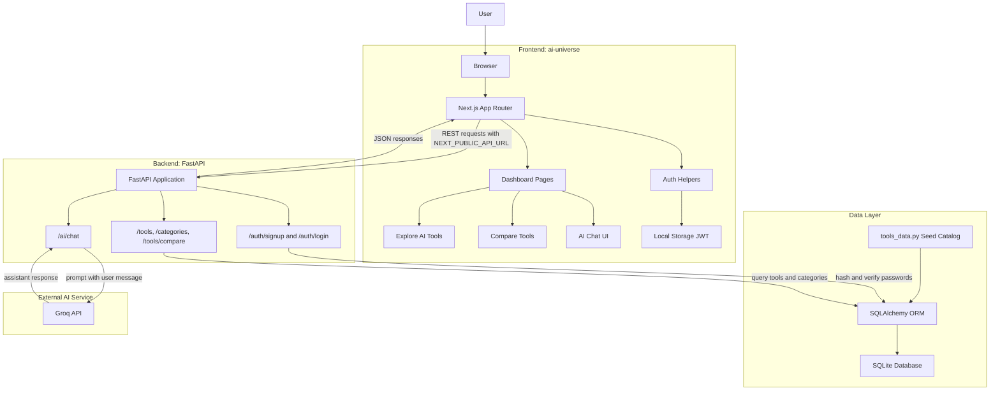

# AI World

> A full-stack AI discovery platform for exploring, comparing, and learning about modern AI tools.

AI World is a full-stack AI discovery and comparison platform. It helps users explore AI tools, compare options side by side, review category trends, and get AI-powered recommendations through a Groq-backed assistant.

The project is organized as a modern web application with a cinematic Next.js dashboard, a FastAPI REST API, SQLite-backed persistence, JWT authentication, and an AI assistant layer powered by Groq.

## Highlights

- Full-stack architecture with separate frontend and backend services.
- Dashboard-first user experience for exploring, comparing, and chatting about AI tools.
- Backend-seeded AI tool catalog with category and comparison endpoints.
- JWT authentication with password hashing.
- Groq-powered assistant for AI tool recommendations.
- Railway-friendly structure for frontend and backend deployment.

## Features

- Explore a curated catalog of AI tools across categories such as chat, coding, automation, productivity, image generation, video, and research.
- Compare up to three AI tools using side-by-side data and interactive visualizations.
- Browse category counts and trending AI tool experiences from the dashboard.
- Sign up and log in with JWT-based authentication.
- Chat with an AI assistant powered by Groq when `GROQ_API_KEY` is configured.
- Enjoy a polished frontend experience built with animations, custom visuals, charts, and responsive dashboard pages.

## Architecture

AI World uses a decoupled client-server architecture. The frontend is responsible for the interactive dashboard, routing, visualization, and local token handling. The backend owns data access, authentication, AI chat orchestration, and database seeding.



### Request Flow

1. The user interacts with the Next.js dashboard in `ai-universe/`.
2. The frontend sends REST requests to the FastAPI backend using `NEXT_PUBLIC_API_URL`.
3. Authentication routes create JWTs and the frontend stores them in local storage.
4. Tool browsing and comparison routes read seeded tool data from SQLite through SQLAlchemy.
5. Chat requests are routed through FastAPI to Groq and returned to the chat interface.

### System Boundaries

| Layer | Responsibility |
| --- | --- |
| Frontend | Dashboard UI, routing, animations, charts, token storage, API calls |
| Backend | REST endpoints, authentication, database access, Groq chat orchestration |
| Database | Users and AI tool catalog persisted through SQLAlchemy models |
| External Service | Groq model inference for assistant responses |

## Tech Stack

### Frontend

- Next.js 16
- React 19
- TypeScript
- Tailwind CSS 4
- Framer Motion
- GSAP
- Three.js
- Recharts
- Lucide React
- React Markdown

### Backend

- FastAPI
- Uvicorn
- SQLAlchemy
- SQLite
- PyJWT
- bcrypt
- Groq SDK
- python-dotenv

## Core Modules

| Path | Purpose |
| --- | --- |
| `ai-universe/app/` | Next.js App Router pages, layouts, and dashboard routes |
| `ai-universe/components/` | Visual components, navigation, cursor effects, and landing sections |
| `ai-universe/utils/api.ts` | Frontend API base URL, JWT helpers, and authenticated fetch wrapper |
| `backend/main.py` | FastAPI app setup, CORS, router registration, tool endpoints, and database seeding |
| `backend/auth.py` | Signup, login, bcrypt password hashing, and JWT creation |
| `backend/groq_service.py` | AI assistant route backed by Groq |
| `backend/database.py` | SQLAlchemy engine, session, and database configuration |
| `backend/tools_data.py` | Seed catalog for AI tools |

## Repository Structure

```text
AI-World/
|-- ai-universe/          # Next.js frontend application
|   |-- app/              # App Router pages and layouts
|   |-- components/       # Reusable UI and animation components
|   |-- public/           # Static assets
|   |-- utils/            # API and auth helpers
|   |-- package.json
|   `-- railway.toml
|-- backend/              # FastAPI backend application
|   |-- main.py           # API entrypoint and tool routes
|   |-- auth.py           # Signup, login, password hashing, JWT creation
|   |-- database.py       # SQLAlchemy database setup
|   |-- groq_service.py   # Groq-powered chat route
|   |-- models.py         # Database models
|   |-- tools_data.py     # Seed data for AI tools
|   |-- requirements.txt
|   `-- railway.toml
|-- parse_tools.py        # Utility script for processing tool data
`-- README.md
```

## Getting Started

### Prerequisites

- Node.js 20 or later
- npm
- Python 3.11 or later
- pip

### 1. Clone the Repository

```bash
git clone https://github.com/Godesivaramakrishna/AI-World-.git
cd AI-World-
```

### 2. Configure Environment Variables

Create `backend/.env`:

```env
JWT_SECRET=replace_with_a_long_random_secret
DATABASE_URL=sqlite:///./aiuniverse.db
GROQ_API_KEY=your_groq_api_key
```

Create `ai-universe/.env.local`:

```env
NEXT_PUBLIC_API_URL=http://localhost:8000
```

`GROQ_API_KEY` is optional for browsing and comparison features. Without it, the chat endpoint returns a configuration message.

### 3. Run the Backend

```bash
cd backend
pip install -r requirements.txt
uvicorn main:app --reload --host 0.0.0.0 --port 8000
```

The backend creates database tables on startup and seeds the tools table when it is empty.

### 4. Run the Frontend

Open a second terminal:

```bash
cd ai-universe
npm install
npm run dev
```

Open the application at:

```text
http://localhost:3000
```

## Available Scripts

Run frontend commands from `ai-universe/`:

```bash
npm run dev      # Start the local development server
npm run build    # Create a production build
npm run start    # Start the production server
npm run lint     # Run ESLint
```

Run backend commands from `backend/`:

```bash
uvicorn main:app --reload --host 0.0.0.0 --port 8000
```

## API Reference

Default local backend URL:

```text
http://localhost:8000
```

| Method | Endpoint | Description |
| --- | --- | --- |
| `GET` | `/tools` | Returns all AI tools |
| `GET` | `/categories` | Returns category names and tool counts |
| `GET` | `/tools/compare?ids=1,2,3` | Returns selected tools for comparison |
| `POST` | `/auth/signup` | Registers a user and returns a JWT |
| `POST` | `/auth/login` | Authenticates a user and returns a JWT |
| `POST` | `/ai/chat` | Sends a prompt to the AI assistant |

Example chat request:

```bash
curl -X POST http://localhost:8000/ai/chat \
  -H "Content-Type: application/json" \
  -d "{\"message\":\"Suggest the best AI tools for coding\"}"
```

## Deployment

This repository is best deployed as two services: one for the backend and one for the frontend.

Important: do not deploy from the repository root as a single Railway service. The root directory does not contain a deployable app because this is a monorepo. Railway must be pointed at the correct app folder for each service.

### Backend on Railway

Recommended settings:

- Root directory: `backend`
- Builder: Nixpacks
- Start command: defined in `backend/railway.toml`

Required variables:

```env
JWT_SECRET=replace_with_a_long_random_secret
DATABASE_URL=sqlite:///./aiuniverse.db
GROQ_API_KEY=your_groq_api_key
```

### Frontend on Railway

Recommended settings:

- Root directory: `ai-universe`
- Builder: Nixpacks
- Build and start commands: defined in `ai-universe/railway.toml`

Required variable:

```env
NEXT_PUBLIC_API_URL=https://your-backend-service.up.railway.app
```

### Fixing Railpack Detection Errors

If Railway shows an error like "Railpack could not determine how to build the app", the service is probably using the repository root.

Set the Railway service root directory based on what the service should run:

| Railway service | Root directory | Why |
| --- | --- | --- |
| Backend API | `backend` | Contains `requirements.txt`, `main.py`, and `backend/railway.toml` |
| Frontend web app | `ai-universe` | Contains `package.json`, Next.js source, and `ai-universe/railway.toml` |

Each app needs its own Railway service:

1. Create a Railway service for the backend and set the root directory to `backend`.
2. Create a Railway service for the frontend and set the root directory to `ai-universe`.
3. Deploy the backend first and copy its public URL.
4. Set `NEXT_PUBLIC_API_URL` in the frontend service to the backend URL.

## Production Notes

- Replace the fallback JWT secret with a strong `JWT_SECRET`.
- Restrict backend CORS origins to the deployed frontend URL.
- Use persistent storage for SQLite, or migrate `DATABASE_URL` to a production database such as PostgreSQL.
- Keep `NEXT_PUBLIC_API_URL` pointed at the deployed backend service.
- Configure `GROQ_API_KEY` only in backend environment variables.
- Run `npm run build` before deploying frontend changes.

## License

No license file is currently included. Add a license before publishing the project or accepting external contributions.
