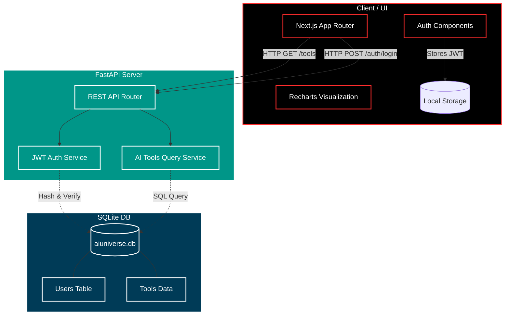

# 🌌 AI Universe

> **The Central Hub for Everything AI.** Discover, compare, and learn about the most advanced Artificial Intelligence platforms in the world.


AI Universe is a futuristic, full-stack intelligence ecosystem built to help users seamlessly navigate the fragmented AI market. From code generation to image synthesis, this platform serves as a visual discovery and comparison engine.

---

## 🚀 Key Features

- **Cyberpunk UI/UX**: An immersive dark mode design featuring glassmorphism, glowing accents, and micro-animations.
- **Visual Comparison Engine**: Compare up to 3 AI tools side-by-side using dynamic Radar, Bar, and Pie charts powered by Recharts.
- **Trending AI**: Hot, curated list of the top-rated AI models every week.
- **A-Z AI Categories**: Easily filter through 200+ AI tools across various categories (Coding, Chat, Automation, Healthcare, Video, etc.).
- **Authentication System**: Full backend-powered login and signup functionality with JWTs and local storage integration.
- **Profile Management**: Sleek user dashboard to manage account details.

---

## 🏗️ Architecture

The system uses a modern decoupled architecture. The Next.js frontend handles server-side routing and client-side visualization, while a FastAPI backend handles the REST endpoints and SQLite database operations.



---

## 💻 Tech Stack

### Frontend
- **Framework**: Next.js (App Router)
- **Library**: React 19
- **Styling**: Vanilla CSS with custom glassmorphism and animated components
- **Charting**: Recharts
- **Icons**: Custom Emojis & UI Typography

### Backend
- **Framework**: FastAPI (Python)
- **Server**: Uvicorn
- **Database**: SQLite (SQLAlchemy ORM)
- **Security**: Passlib (Bcrypt), python-jose (JWT)

---

## ⚙️ Getting Started

### 1. Start the Backend
Navigate to the `backend` directory and install the requirements:
```bash
cd backend
pip install fastapi uvicorn sqlalchemy passlib bcrypt python-jose pydantic python-multipart
```
Run the FastAPI server:
```bash
uvicorn main:app --reload --port 8000
```
*Note: On the first run, the backend will automatically seed the SQLite database with 200+ AI tools.*

### 2. Start the Frontend
Navigate to the `ai-universe` directory:
```bash
cd ai-universe
npm install
npm run dev
```
Access the application at `http://localhost:3000`.

---

## 🎨 Design Philosophy
AI Universe avoids the "generic corporate AI" feel. We focus on a sleek, aggressive design language with dark backgrounds (`#000000`), vibrant red accents (`#FF2D2D`), and smooth interactions that make the UI feel alive and responsive.
